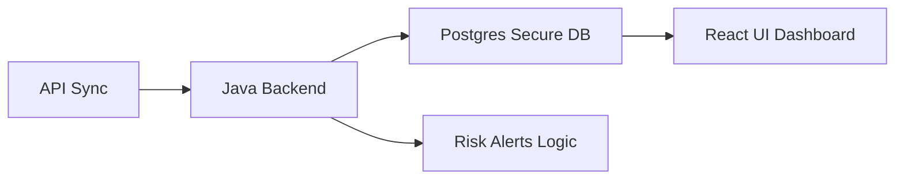

# **BlockfolioX**
## **Elite Crypto Portfolio Analytics Hub**

**Team BlockfolioX:**
- Aarushi Garg
- RITHIKAA VENKATANATHAN P R
- Ashmit Yadav
- Lavanya T
- Vanshika Sharma

---

# **01. Technology Stack**
## **Modern Engineering Architecture**

- **Frontend Core:** React 19, TypeScript, Vite, Tailwind CSS.  
- **Backend Architecture:** Java Spring Boot 3.2, JPA, Spring Security.  
- **Database Engine:** Supabase (Cloud PostgreSQL).  
- **Third-Party Integrations:** CoinGecko, Etherscan, CryptoScamDB.  
- **Security Standards:** AES-256-GCM Cryptographic Encryption & JWT Auth.  

<footer>Slide 01 | BlockfolioX Built Stack</footer>

---

# **02. Project Overview**
## **Why BlockfolioX?**

- **Fragmentation Fix:** A unified dashboard for assets scattered across various exchanges.  
- **Security Guardian:** Automated contract scanning to protect users from rug pulls and scam tokens.  
- **Audit Simplicity:** One-click automated tax and P&L history report generation.  
- **Real-Time Data:** Live market price feeds and sub-second balancing updates.  

---

# **03. Project Workflow**
## **High-Speed Data Sync Pipeline**

- **Step 1:** Synchronizing wallet balances via secure REST API clients.  
- **Step 2:** Processing net equity and historical trades in the Java environment.  
- **Step 3:** Rendering optimized charts and real-time alerts to the dashboard.  

<footer>Slide 03 | BlockfolioX Workflow Architecture</footer>

---

# **04. Component: Dashboard**
## **The Strategic Health Hub**

- **Working:** Aggregates real-time price feeds into a single net-worth view.  
- **Logic:** Instant calculation of 24h gain/loss and performance percentage tracking.  
- **Visuals:** High-fidelity charts detailing 7-day equity trends and profit snapshots.  

---

# **05. Component: Portfolio**
## **Precision Asset Management**

- **Working:** Deep tracking of individual token quantities and average buy prices.  
- **Logic:** Intelligent mapping of symbols to market prices for precise value tracking.  
- **Visuals:** Professional glassmorphism ledger showing total asset distribution.  

---

# **06. Component: Trades**
## **The Verified Transaction Ledger**

- **Working:** A comprehensive record of every buy/sell transaction across platforms.  
- **Logic:** Automatic fee deduction and net-profit calculation for every singular trade.  
- **Interface:** Clean, filterable historical data sorted by currency and date.  

---

# **07. Component: Risk Alerts**
## **Proprietary Scam Detection Engine**

- **Working:** Automated scanning of token contract addresses for malicious signatures.  
- **Logic:** Cross-references data from CryptoScamDB and Etherscan to flag "Rug Pulls."  
- **Status:** Integrated identification of **High, Medium, and Low risk** tokens.  

---

# **08. Component: Exchange Sync**
## **Secure Connectivity Pipeline**

- **Working:** Synchronization with Central Exchanges (CEX) via encrypted REST endpoints.  
- **Security:** Military-grade **AES-256-GCM encryption** for all exchange API keys.  
- **Logic:** Background tasks fetch wallet balances without ever storing withdrawal keys.  

---

# **09. Component: Reports**
## **Audit-Ready Tax Summaries**

- **Working:** Automated generation of Tax-compliant P&L and transaction summaries.  
- **Analytics:** Calculation of annualized returns, total profit, and fee expenditure.  
- **Export:** Native CSV/Excel generation with one-click secure download.  

---

# **10. Conclusion & Roadmap**
## **The Future of Portfolio Intelligence**

- **Vision:** BlockfolioX is the premier secure bridge for the modern crypto investor.  
- **Upcoming:** AI-driven price prediction logic and native mobile iOS/Android applications.  

### **Thank You for Your Attention!**

